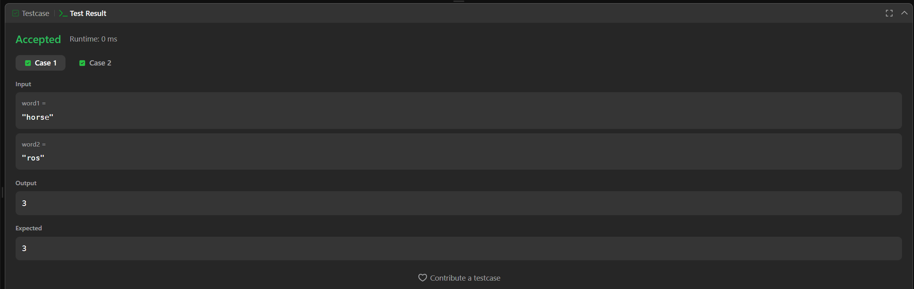
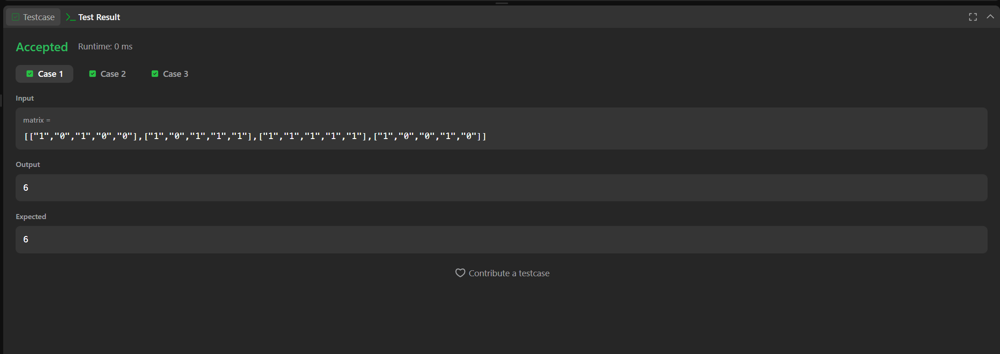

# ProgramacaoDinamica_Dupla_Leetcode

## Video da apresentação: x

## 📋 Informações do Projeto
**Disciplina:** Programação Dinâmica  
**Número da Lista:** 5  
**Linguagem:** C

## 👥 Alunos
| Nome | Matrícula |
|------|-----------|
| Patrick Anderson Carvalho dos Santos | 211030620 |
| Vinícius Eduardo Muniz da Silva | 211031870 |

## 📖 Sobre
Resolução de exercícios do LeetCode focados em Programação Dinâmica, de acordo com as condições propostas pelo professor em sala de aula.

## Exercícios
Serão realizados 2 exercícios, sendo 1 de nível Médio e 1 de nível Difícil.

| Nome | Dificuldade | Link LeetCode | Link Resolução |
|------|-------------|---------------|----------------|
| [72. Edit Distance](https://leetcode.com/problems/edit-distance/description/?envType=problem-list-v2&envId=dynamic-programming) | Médio | [LeetCode](https://leetcode.com/problems/edit-distance/description/?envType=problem-list-v2&envId=dynamic-programming) | [Resolução](./Questao-72-Edit-Distance/EditDistance.png) |
| [85. Maximal Rectangle](https://leetcode.com/problems/maximal-rectangle/description/?envType=problem-list-v2&envId=dynamic-programming) | Difícil | [LeetCode](https://leetcode.com/problems/maximal-rectangle/description/?envType=problem-list-v2&envId=dynamic-programming) | [Resolução](./Questao-85-Maximal-Rectangle/MaximalRectangle.png) |

## 📸 Screenshots
Veja abaixo as imagens da execução das questões:

### Questão 72: Edit Distance


### Questão 85: Maximal Rectangle


## 🛠️ Instalação
**Pré-requisitos:**
- Compilador C (gcc recomendado)
- Sistema operacional compatível

**Comandos necessários:**
```bash
# Clone o repositório
git clone https://github.com/projeto-de-algoritmos-2025/ProgramacaoDinamica_Dupla_Leetcode.git

# Entre no diretório do projeto
cd ProgramacaoDinamica_Dupla_Leetcode

# Compile o arquivo C da questão desejada
gcc -o editDistance Questao-72-Edit-Distance/EditDistance.c
gcc -o maximalRectangle Questao-85-Maximal-Rectangle/MaximalRectangle.c

# Execute o programa compilado
./editDistance
./maximalRectangle
```

## 📂 Estrutura do Projeto
```
ProgramacaoDinamica_Dupla_Leetcode/
│
├── README.md
│
├── Questao-72-Edit-Distance/
│   ├── EditDistance.c
│   └── EditDistance.png
│
└── Questao-85-Maximal-Rectangle/
    ├── MaximalRectangle.c
    └── MaximalRectangle.png
```

## 🎯 Conceitos Utilizados
Os exercícios exploram os seguintes conceitos de Programação Dinâmica:
- **Edit Distance**: Distância de Levenshtein usando matriz DP
- **Maximal Rectangle**: Combinação de DP com algoritmo de histograma para encontrar o maior retângulo em uma matriz binária